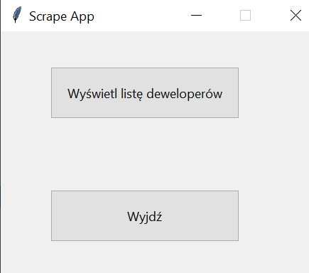
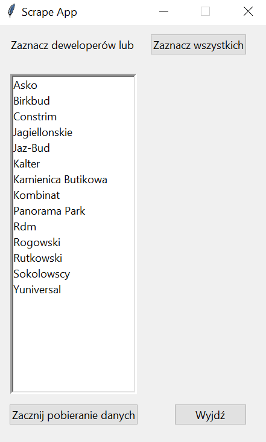

# Scrape App with GUI

> Scrape app using graphical user interface (GUI)

## Table of Contents

- [General Info](#general-information)
- [Technologies Used](#technologies-used)
- [Screenshots](#screenshots)
- [Setup](#setup)
- [Features](#features)
- [Project Status](#project-status)

## General Information

- App with GUI for scraping data(scrape files are nor longer supported: for lasted check my other repo [here](https://github.com/owsiej/DeveloperScrapeDjango)) and saving it to an excel file.

## Technologies Used

Main techs used in app are:

- Python 3.11
- tkinter
- BeautifulSoup4
- Selenium

All versions you can check in [requirement.txt file](https://github.com/owsiej/ScrapeWithGui/blob/main/requirements.txt).

## Screenshots




## Setup

To make it run:

- install [Python 3.11](https://www.python.org/downloads/release/python-3110/)
- install [pip](https://pip.pypa.io/en/stable/installation/)
- install all requirements in main dir using

```
$ pip install -r requirements.txt
```

- run file `ScrapeGui.py`

## Features

- clear and simple interface
- save data to excel file
- has got loading windows during scrape

## Project Status

Project is no longer being developed. Scrape files are not up to date as whole thing was moved to more scalable version written in Django, which you can find [here](https://github.com/owsiej/DeveloperScrapeDjango). Interface alone works fine and can be used to different tasks.
